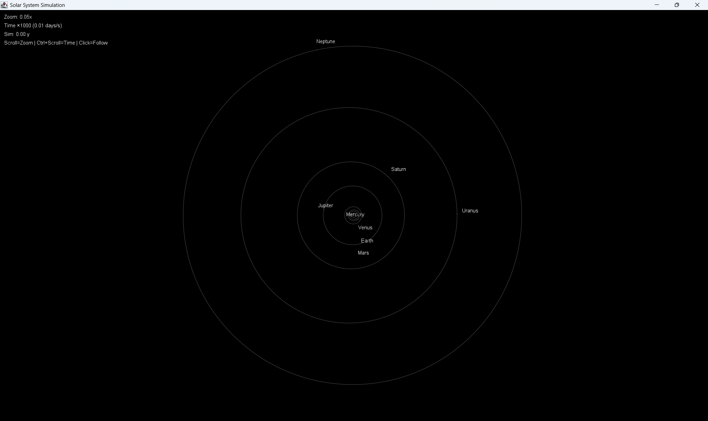
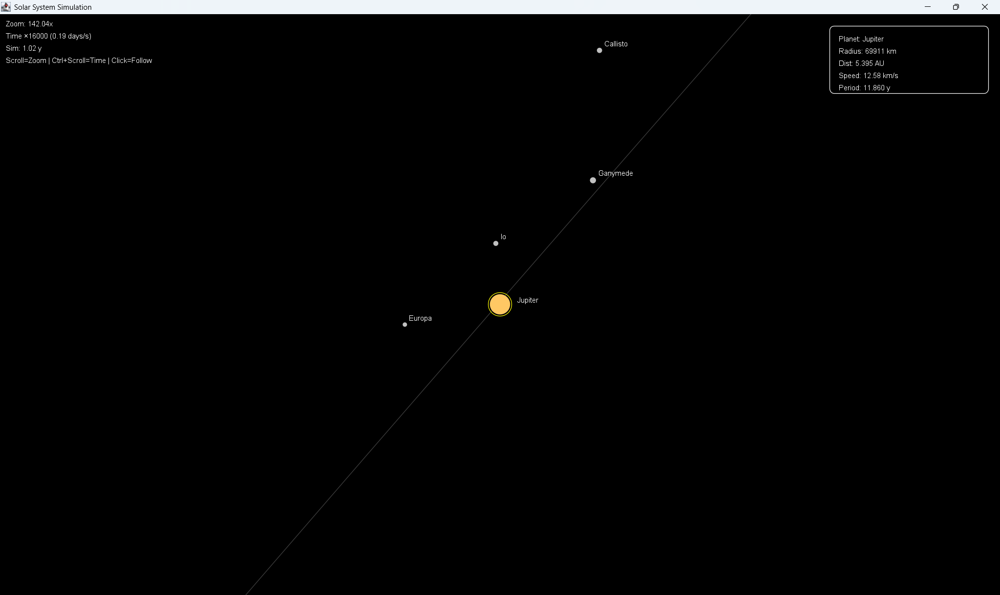

# Solar System Simulation 🌌

**A real-time, interactive 2D orbital mechanics simulator** built in Java Swing.  
Accurately models **Keplerian orbits** using **Newton-Raphson** to solve the eccentric anomaly, with **moons**, **zoom**, **time scaling**, and **planet-following**.

> **100% stable** – no drift, no wobble. Instant camera snap. Smooth interpolation.

---

## Features

| Feature | Description |
|-------|-----------|
| **Keplerian Orbits** | Accurate elliptical paths using `E - e*sin(E) = M` |
| **Moons** | Earth, Mars, Jupiter, Saturn, Uranus, Neptune with correct periods |
| **Dynamic Zoom** | Scroll to zoom from solar system to individual moons |
| **Time Control** | `Ctrl+Scroll` to speed up/slow down simulation |
| **Planet Following** | Click any planet to lock camera |
| **HUD & Info Panel** | Real-time stats: distance, speed, period |
| **Anti-aliased Rendering** | High-quality visuals with `RenderingHints` |
| **No Drift** | Uses delta-time and modular arithmetic |

---

## Screenshots

| Overview | Earth & Moon (Zoomed) | Jupiter & Moons |
|--------|------------------------|-----------------|
|  |  |  |

---

## How to Run

### Prerequisites
- **Java 8 or higher** (OpenJDK or Oracle JDK)
- No external dependencies

### Steps

```bash
# 1. Clone the repository
git clone https://github.com/yourusername/SolarSystemSimulation.git
cd SolarSystemSimulation

# 2. Compile
javac src/SolarSystemSimulation.java

# 3. Run
java -cp src SolarSystemSimulation
